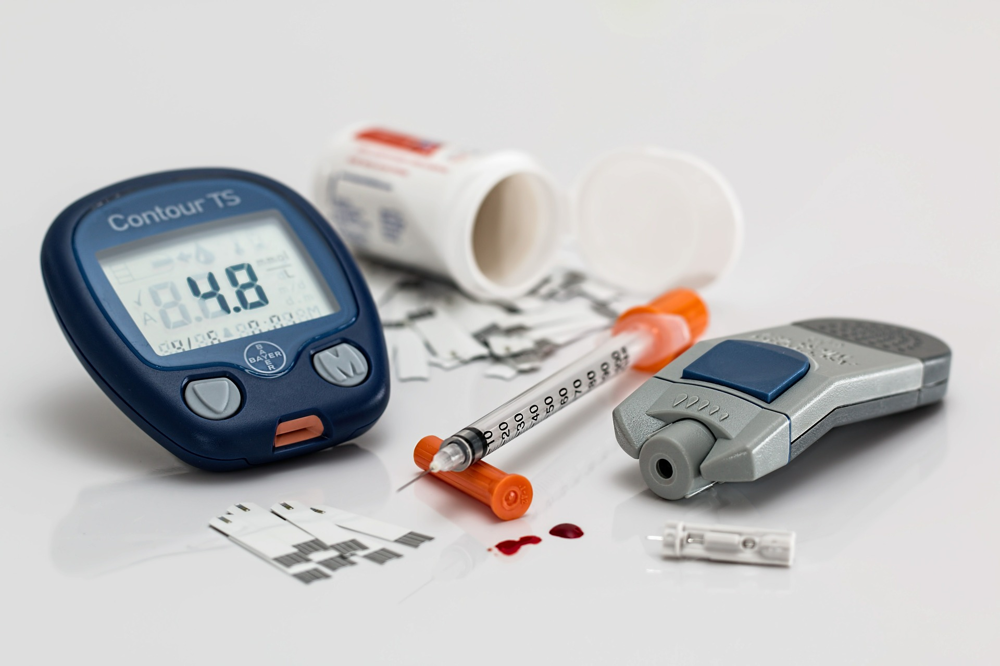

# Detect Diabetes Using TensorFlow 2.0



This project classifies user sentiment of Alexa devices using ANN (Artificial Neural Networks) and [Tensorflow](https://www.tensorflow.org) 2.0. 

### Data Reference:

This dataset is used to predict whether or not a patient has diabetes, based on given features/diagnostic measurements.

Only female patients are considered with at least 21 years old of Pima Indian heritage.

Inputs:

Pregnancies: Number of times pregnant
GlucosePlasma: glucose concentration a 2 hours in an oral glucose tolerance test
BloodPressure: Diastolic blood pressure (mm Hg)
Skin: ThicknessTriceps skin fold thickness (mm)
Insulin: 2-Hour serum insulin (mu U/ml)
BMI: Body mass index (weight in kg/(height in m)^2)
DiabetesPedigreeFunction: Diabetes pedigree function
Age: Age (years)

Outputs:

Diabetes or no diabetes (0 or 1)

Acknowledgements Smith, J.W., Everhart, J.E., Dickson, W.C., Knowler, W.C., & Johannes, R.S. (1988). Using the ADAP learning algorithm to forecast the onset of diabetes mellitus. In Proceedings of the Symposium on Computer Applications and Medical Care (pp. 261--265). IEEE Computer Society Press.

You can find the data in this directory. The file is: diabetes.csv

### Step 1: Open a [Colab](https://colab.research.google.com) python notebook

### Step 2: Import TensorFlow and Python Libraries


```
!pip install tensorflow-gpu==2.0.0.alpha0
import tensorflow as tf
import pandas as pd
import numpy as np
import seaborn as sns
import matplotlib.pyplot as plt
```

### Step 3: Import the dataset

You will need to mount your drive using the following commands:
For more information regarding mounting, please check this out [here](https://stackoverflow.com/questions/46986398/import-data-into-google-colaboratory).


```
from google.colab import drive
drive.mount('/content/drive')
```

Upload the data file from Kaggle to your Google drive and then access it

```
diabetes = pd.read_csv('/content/drive/My Drive/Colab Notebooks/diabetes.csv')
```

Get more information about your dataset
```
diabetes.info()
diabetes.describe()
diabetes.head(10)
diabetes.tail(10)
```

### Step 4: Visualize the dataset using Seaborn, a python library
See more steps in the colab.

### Step 5: Create testing and training data set and clean the data. 
See steps in the colab.

### Step 6: Train the Model. 
See steps in the colab.

### Step 7: Evaluate the Model. 
See steps in the colab.

### Step 8: Improve the Model
If you are not satisfied with the results, then you can increase the number of independent variables and retrain the same model. See steps in the colab.
